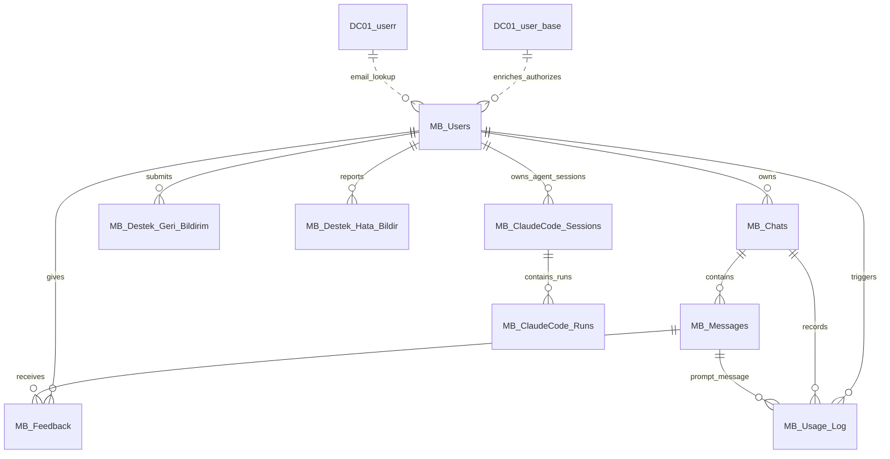

# MERGEN Bilge Veritabanı Tablo Yapısı

Bu belge, MERGEN Bilge uygulamasının güncel R kaynaklarında kullanılan veritabanı tablolarını ve tablo etkileşimlerini özetler. Canlı SQL Server şemasından otomatik üretilmiş DDL değildir; uygulama kodundaki sorgular, yazma yardımcıları, yönetici sorguları ve VM preflight beklentileri temel alınarak hazırlanmış operasyonel referanstır.

> **Kritik sınır:** DB yazma/okuma yollarında Türkçe karakter bütünlüğü, DB-safe Unicode escape/restore ve mojibake guard'ları korunmalıdır. DB helper veya şema değişikliği öncesinde [`../CLAUDE.md`](../CLAUDE.md), [`architecture-map.md`](architecture-map.md) ve [`../RUNBOOK.md`](../RUNBOOK.md) okunmalıdır.

## Kanıt Kaynakları

| Kaynak | Kapsam |
|---|---|
| `R/helpers_database.R` | `MB_Users` oluşturma/güncelleme, `DC01_user_base` kullanıcı adı/tam ad okuması, kullanıcı profili okuma. |
| `R/helpers_db_user_encoding.R` | `MB_Users` SSO alanlarının koşullu güncellenmesi ve kolon varlığı kontrolü. |
| `R/helpers_db_chat_mutations.R` | `MB_Chats`, `MB_Messages`, `MB_Usage_Log` yazma/güncelleme/soft-delete davranışı. |
| `R/helpers_db_chat_readers.R` | Sohbet listesi, arama ve mesaj hidratasyonu için `MB_Chats`/`MB_Messages` okuma davranışı. |
| `R/helpers_db_feedback.R` | `MB_Feedback` merge/delete/read ve `MB_Usage_Log` insert davranışı. |
| `R/helpers_destek_database.R` | `MB_Destek_Geri_Bildirim` ve `MB_Destek_Hata_Bildir` insert/list/update davranışı. |
| `R/helpers_admin_geri_bildirim_queries.R`, `R/helpers_admin_hata_analizi.R`, `R/helpers_admin_yanit_analizi.R` | Yönetici panelleri için join, trend ve analiz sorguları. |
| `R/helpers_sso.R` | `DC01_user_base` yetkilendirme okuması. |
| `tests/scripts/run_vm_encoding_preflight_real.R` | VM/SQL Server Türkçe kodlama preflight için kritik tablo/kolon beklentileri. |
| `R/helpers_db_claude_code_session_queries.R`, `R/helpers_db_claude_code_sessions.R` | Bilge Yolaç kalıcı oturumları: `MB_ClaudeCode_Sessions` / `MB_ClaudeCode_Runs` oluşturma/listeleme/yükleme/yumuşak silme davranışı. |

## Tablo Akış Diyagramı

## Uygulama Sahipliğindeki Ana Tablolar

### `MB_Users`

Kullanıcı kimliği ve SSO ile zenginleşen profil alanlarını tutar. `KullaniciAdi` teknik kimliktir; kullanıcıya görünen ad ve organizasyon alanları merkezi DB encoding helper'larından geçmelidir.

| Kolon | Yaklaşık tip | Kullanım / not |
|---|---|---|
| `UserID` | `INT` veya `BIGINT` | Uygulama içi kullanıcı anahtarı; insert sonrası `OUTPUT INSERTED.UserID` ile alınır. |
| `KullaniciAdi` | `NVARCHAR(255)` | Teknik kullanıcı adı; `DC01_user_base.KullaniciAdi`, SSO `preferred_username` ve session identity ile eşleşir. |
| `KaynakAdi` | `NVARCHAR(255)` | Kullanıcıya görünen tam ad; SSO `full_name` veya `DC01_user_base.KaynakAdi` ile beslenir. |
| `LastLoginDate` | `DATETIME` | Kullanıcı bulunduğunda veya oluşturulduğunda `GETDATE()` ile güncellenir. |
| `Sicil` | `NVARCHAR(50)` | SSO claim alanı; kolon varsa güncellenir. |
| `Email` | `NVARCHAR(255)` | SSO claim alanı; kolon varsa güncellenir. |
| `Sektor` | `NVARCHAR(100)` | Kullanıcıya görünen SSO organizasyon alanı; kolon varsa güncellenir. |
| `Departman` | `NVARCHAR(200)` | Sidebar ve profil zenginleştirmede kullanılan SSO organizasyon alanı; kolon varsa güncellenir. |
| `Mudurluk` | `NVARCHAR(200)` | SSO organizasyon alanı; kolon varsa güncellenir. |
| `MasrafYeriKodu` | `NVARCHAR(200)` | Teknik SSO/organizasyon alanı; kolon varsa güncellenir. |
| `SonGirisKaynagi` | `NVARCHAR(50)` | SSO güncellemesinde `keycloak` olarak yazılır; yerel/SSO ayrımı için kullanılır. |

### `MB_Chats`

Sohbet oturumlarının üst verisini tutar. Silme işlemleri fiziksel delete değil `IsDeleted = 1` soft-delete olarak uygulanır.

| Kolon | Yaklaşık tip | Kullanım / not |
|---|---|---|
| `ChatID` | `INT` veya `BIGINT` | Sohbet anahtarı; insert sonrası `OUTPUT INSERTED.ChatID` ile alınır. |
| `UserID` | `INT` veya `BIGINT` | `MB_Users.UserID` ile ilişkilidir; listeleme ve soft-delete kullanıcıya göre filtrelenir. |
| `ChatTitle` | `NVARCHAR(500)` | İlk istemden veya kullanıcı düzenlemesinden gelen başlık; güncellenebilir. |
| `CreateTimestamp` | `DATETIME` | Sohbet oluşturma zamanı; listeleme ve aramada kullanılır. |
| `IsDeleted` | `BIT` veya `TINYINT` | Soft-delete bayrağı; okuma sorguları `ISNULL(c.IsDeleted, 0) = 0` filtresini kullanır. |

### `MB_Messages`

Kullanıcı, asistan ve sistem mesajlarını tutar. Mesaj sırası `MessageOrder` ile korunur; yeni mesaj yazımında ilgili sohbet için `MAX(MessageOrder) + 1` hesaplanır ve SQL Server lock hint'leriyle yarış koşulu azaltılır.

| Kolon | Yaklaşık tip | Kullanım / not |
|---|---|---|
| `MessageID` | `INT` veya `BIGINT` | Mesaj anahtarı; insert sonrası `OUTPUT INSERTED.MessageID` ile alınır. |
| `ChatID` | `INT` veya `BIGINT` | `MB_Chats.ChatID` ile ilişkilidir. |
| `MessageContent` | `NVARCHAR(MAX)` | Görünen mesaj metni; DB-safe encoding ve read/hydration normalizasyonu kritiktir. |
| `MessageType` | `NVARCHAR(50)` | `user`, `ai` veya sistem benzeri mesaj türleri. |
| `MessageTimestamp` | `DATETIME` | Mesaj oluşturma zamanı; listeleme, arama ve fallback trend hesaplarında kullanılır. |
| `MessageOrder` | `INT` | Sohbet içi sıralama. |
| `ReasoningContent` | `NVARCHAR(MAX)` | Thinking modellerinin akıl yürütme içeriği; kolon varlığı runtime'da kontrol edilir ve yoksa legacy fallback kullanılır. |

### `MB_Feedback`

Kullanıcıların asistan mesajlarına verdiği yanıt geri bildirimini tutar. Uygulama `UserID + MessageID` kombinasyonunu merge anahtarı gibi kullanır.

| Kolon | Yaklaşık tip | Kullanım / not |
|---|---|---|
| `UserID` | `INT` veya `BIGINT` | Geri bildirimi veren kullanıcı; `MB_Users.UserID` ile ilişkilidir. |
| `MessageID` | `INT` veya `BIGINT` | Geri bildirim verilen mesaj; `MB_Messages.MessageID` ile ilişkilidir. |
| `FeedbackType` | `NVARCHAR(50)` | `like`, `dislike` vb. teknik değer. |
| `FeedbackTags` | `NVARCHAR(500)` | Seçilen etiketler; opsiyonel. |
| `FeedbackComment` | `NVARCHAR(MAX)` | Serbest metin yorum; opsiyonel. |
| `FeedbackTimestamp` | `DATETIME2(0)` | Extended feedback merge sırasında `CAST(GETDATE() AS datetime2(0))` ile yazılır/güncellenir. |

### `MB_Usage_Log`

LLM/API çağrılarının performans ve başarı izini tutar. Yanıt analizi ve yönetici panelleri için kullanılır.

| Kolon | Yaklaşık tip | Kullanım / not |
|---|---|---|
| `LogID` | `INT` veya `BIGINT` | Günlük kaydı anahtarı; uygulama insert sırasında açıkça yazmaz. |
| `ChatID` | `INT` veya `BIGINT` | Çağrının bağlı olduğu sohbet. |
| `MessageID` | `INT` veya `BIGINT` | Çağrıyı tetikleyen kullanıcı mesajı. |
| `UserID` | `INT` veya `BIGINT` | Çağrıyı tetikleyen kullanıcı. |
| `ModelUsed` | `NVARCHAR(100)` veya daha geniş | Kullanılan model kimliği; teknik değer olarak normalize edilir. |
| `ResponseDuration` | `DECIMAL`, `FLOAT` veya benzeri | Yanıt süresi. |
| `ResponseSuccess` | `BIT` veya `TINYINT` | Başarı bayrağı. |

## Bilge Yolaç (Claude Code) Kalıcı Oturum Tabloları

Bilge Yolaç bir ajan/çalışma alanı ortamıdır; oturum yapısı (Claude CLI resume kimliği, kaynak/runtime workdir, model/çalışan model, araç çağrıları, üretilen dosya metadata'sı, çalıştırma durumu) normal sohbet şemasına sığmadığı için bu aile **kasıtlı olarak `MB_Chats` / `MB_Messages`'tan AYRIDIR**. Kullanıcı ilişkisi `UserID` üzerinden `MB_Users` iledir.

Kurulum betiği: [`sql/2026-07-bilge-yolac-sessions.sql`](sql/2026-07-bilge-yolac-sessions.sql). Betik idempotenttir, uygulama açılışında OTOMATİK ÇALIŞTIRILMAZ ve yıkıcı ifade içermez (bkz. `RUNBOOK.md` "Bilge Yolaç oturum tabloları" kontrol listesi). Tablolar henüz kurulmamışsa runtime yardımcıları (`R/helpers_db_claude_code_sessions.R`) uyarı loglayıp güvenli boş/NULL sonuç döner; Bilge Yolaç bellek-içi modda çalışmaya devam eder.

### `MB_ClaudeCode_Sessions`

Dayanıklı oturum başlığını tutar: bir çalışma alanı sohbeti = bir oturum kaydı.

| Kolon | Yaklaşık tip | Kullanım / not |
|---|---|---|
| `ClaudeSessionRecordID` | `BIGINT IDENTITY` | Oturum kaydı anahtarı; insert sonrası `OUTPUT INSERTED` ile alınır. |
| `UserID` | `BIGINT` | Sahip kullanıcı; tüm liste/yükleme/arşivleme sorguları kullanıcı-izoledir. |
| `ClaudeCliSessionID` | `NVARCHAR(200)` | Claude CLI `--resume` oturum kimliği; teknik değer, mojibake onarımı uygulanmaz. |
| `SessionTitle` | `NVARCHAR(500)` | İlk prompttan üretilen kullanıcıya görünen başlık; `normalize_db_visible_value()` ile yazılır. |
| `Workdir` / `SourceWorkdir` / `RuntimeWorkdir` | `NVARCHAR(MAX)` | Seçilen/kaynak/aynalanmış runtime dizinleri; teknik yol değerleri. Resume güvenliği runtime dizin varlığına bağlıdır. |
| `ModelUsed` / `RuntimeModel` | `NVARCHAR(100)` | Seçilen ve gerçekte çalıştırılan model kimlikleri; teknik değer. |
| `CharacterID` | `NVARCHAR(50)` | Persona kimliği (`emre`, `selin`, ...). |
| `Status` | `NVARCHAR(50)` | Teknik durum: `active` / `completed` / `failed` / `stopped`. |
| `CreatedAt` / `LastRunAt` | `DATETIME2(0)` | Oluşturma ve son çalıştırma zamanı; liste "son etkinlik" sıralaması `COALESCE(LastRunAt, CreatedAt)` kullanır. |
| `IsDeleted` | `BIT` | Yumuşak silme/arşiv bayrağı; fiziksel silme yapılmaz. |
| `SessionMetaJson` | `NVARCHAR(MAX)` | Küçük teknik metadata JSON'u (ör. `created_from`); gizli değer yazılmaz. |

Önerilen indeks: `IX_MB_ClaudeCode_Sessions_User_Recent (UserID, IsDeleted, LastRunAt DESC, CreatedAt DESC)`.

### `MB_ClaudeCode_Runs`

Her prompt/sonuç/araç çalıştırma birimini ekleme-odaklı saklar.

| Kolon | Yaklaşık tip | Kullanım / not |
|---|---|---|
| `ClaudeRunID` | `BIGINT IDENTITY` | Çalıştırma anahtarı. |
| `ClaudeSessionRecordID` | `BIGINT` (FK) | Bağlı oturum; `MB_ClaudeCode_Sessions` FK. |
| `RunOrder` | `INT` | Oturum içi sıra; üretim T-SQL yolunda `UPDLOCK/HOLDLOCK` ile üretilir. |
| `Prompt` | `NVARCHAR(MAX)` | Kullanıcı komutu; görünen değer normalizasyonundan geçer. |
| `FinalOutput` | `NVARCHAR(MAX)` | Asistan yanıtı; başarısız çalıştırmada hata mesajı burada saklanır. |
| `Status` | `NVARCHAR(50)` | `completed` / `failed` / `stopped`. |
| `ExitCode` / `DurationSeconds` | `INT` / `DECIMAL(10,2)` | CLI çıkış kodu ve süre. |
| `ToolUsesJson` | `NVARCHAR(MAX)` | Küçültülmüş araç kullanımı metadata JSON'u (ad + kısaltılmış girdi/sonuç). |
| `GeneratedDownloadsJson` | `NVARCHAR(MAX)` | Üretilen dosya METADATA'sı (ad, boyut, indirme yolu); ikili içerik ASLA saklanmaz. |
| `RawStreamJsonl` | `NVARCHAR(MAX)` | Ham stream-json satırları; uygulama tarafında ~400.000 karakterde `[[MERGEN-RAW-STREAM-TRUNCATED]]` işaretiyle kesilir (`mergen.claude_code.raw_stream_max_chars`). |
| `CreatedAt` | `DATETIME2(0)` | Kayıt zamanı. |

Önerilen indeks: `IX_MB_ClaudeCode_Runs_Session_Order (ClaudeSessionRecordID, RunOrder ASC)`.

Bakım notları:

- Türkçe metin bütünlüğü merkezi DB encoding yardımcılarıyla korunur: görünen alanlar (`SessionTitle`, `Prompt`, `FinalOutput`) `normalize_db_visible_value()`, teknik alanlar `normalize_db_technical_value()` ile yazılır; tüm parametreler `normalize_db_params()` üzerinden bağlanır. `DB_CLIENT_ENCODING=WINDOWS-1254` üretim sözleşmesi değişmez.
- Okuma sınırında yalnızca görünen kolonlar `normalize_db_read_visible_value()` ile geri açılır; `Workdir`, model kimlikleri ve `Status` gibi teknik kolonlara mojibake onarımı uygulanmaz.
- Bu tablolara API anahtarı, token, ortam değişkeni veya ikili dosya içeriği yazılmaz.
- "Çıktıyı Temizle", model değişimi ve workdir değişimi kalıcı geçmişi SİLMEZ; yalnızca aktif oturum bağını koparır. Arşivleme yalnızca Oturumlar sayfasındaki açık kullanıcı eylemiyle `IsDeleted = 1` olarak yapılır.

## Destek ve Yönetici Panelleri Tabloları

### `MB_Destek_Geri_Bildirim`

Destek sayfasındaki memnuniyet/NPS/öneri formunu ve yönetici geri bildirim analizi verisini tutar.

| Kolon | Yaklaşık tip | Kullanım / not |
|---|---|---|
| `GeriBildirimID` | `INT` veya `BIGINT` | Kayıt anahtarı; insert sonrası `OUTPUT INSERTED.GeriBildirimID` ile alınır. |
| `UserID` | `INT` veya `BIGINT` | Gönderen kullanıcı; `MB_Users.UserID` ile ilişkilidir. |
| `Memnuniyet` | `INT` | 1-5 memnuniyet puanı. |
| `NPS_Puan` | `INT` | 0-10 NPS puanı; opsiyonel olabilir. |
| `Etiketler` | `NVARCHAR(500)` | Seçilen etiketler; virgülle ayrılmış olabilir. |
| `EnCokSevilen` | `NVARCHAR(500)` | Serbest metin alanı; opsiyonel. |
| `Gelistirme` | `NVARCHAR(500)` | Serbest metin alanı; opsiyonel. |
| `IletisimIzni` | `BIT` veya `TINYINT` | Kullanıcının iletişim izni. |
| `OlusturmaTarihi` | `DATETIME` | `GETDATE()` ile yazılır; trend ve sıralama sorgularında kullanılır. |

### `MB_Destek_Hata_Bildir`

Destek sayfasındaki hata bildirimi formunu, durum takibini ve hata analizi paneli verisini tutar.

| Kolon | Yaklaşık tip | Kullanım / not |
|---|---|---|
| `HataBildirimID` | `INT` veya `BIGINT` | Kayıt anahtarı; insert sonrası `OUTPUT INSERTED.HataBildirimID` ile alınır. |
| `UserID` | `INT` veya `BIGINT` | Bildirimi gönderen kullanıcı; `MB_Users.UserID` ile ilişkilidir. |
| `Konular` | `NVARCHAR(MAX)` | Hata konuları; çoklu değerler uygulama tarafında metin olarak tutulur. |
| `Kategoriler` | `NVARCHAR(500)` | Seçilen kategoriler; analiz sorgularında ayrıştırılır. |
| `Oncelik` | `NVARCHAR(50)` | `dusuk`, `orta`, `yuksek`, `kritik` gibi teknik değerler. |
| `Aciklama` | `NVARCHAR(MAX)` | Kullanıcı açıklaması / yeniden üretme adımları. |
| `EkDosyaYollari` | `NVARCHAR(MAX)` | Ek dosya yolları; teknik/path değeri olarak normalize edilmelidir. |
| `Durum` | `NVARCHAR(50)` | Varsayılan `acik`; yönetici panelinden `inceleme`, `cozuldu`, `kapandi`, `reddedildi` değerlerine güncellenebilir. |
| `OlusturmaTarihi` | `DATETIME` | `GETDATE()` ile yazılır; trend ve sıralama sorgularında kullanılır. |

## Harici / Kurumsal Kaynak Tablolar

### `DC01_user_base`

Kullanıcı tam adı, yetki ve masraf yeri bilgisini sağlayan kurumsal kaynak tablodur. SSO yetkilendirme fail-closed davranışı bu tabloya erişimi kritik kabul eder.

| Kolon | Yaklaşık tip | Kullanım / not |
|---|---|---|
| `KullaniciAdi` | `NVARCHAR(255)` | SSO `preferred_username` veya yedek sicil eşleşmesinde kullanılır. |
| `KaynakAdi` | `NVARCHAR(255)` | Tam ad; `MB_Users.KaynakAdi` için fallback kaynak olabilir. |
| `Yetki` | `VARCHAR`/`NVARCHAR` | SSO yetki seviyesi; erişim kontrolünde kullanılır. |
| `MasrafYeriKodu` | `NVARCHAR(200)` | Organizasyon/masraf yeri bilgisi; teknik değer olarak normalize edilir. |

### `DC01_userr`

Yönetici geri bildirim analizi ekranında kullanıcı e-posta adresi zenginleştirmesi için kullanılan harici kaynak tablodur.

| Kolon | Yaklaşık tip | Kullanım / not |
|---|---|---|
| `Name` | `NVARCHAR(255)` | `MB_Users.KullaniciAdi` ile join edilir. |
| `EmailAddress` | `NVARCHAR(255)` | Yönetici panelinde iletişim/e-posta bağlamı için okunur. |

## Sorgu ve Etkileşim Özetleri

| Akış | Tablolar | Not |
|---|---|---|
| Kullanıcı oturumu | `DC01_user_base` → `MB_Users` | SSO claim varsa profil alanları güncellenir; yerel modda kullanıcı adıyla kayıt oluşturulur/güncellenir. |
| Sohbet oluşturma | `MB_Users` → `MB_Chats` | Her sohbet kullanıcıya bağlıdır; başlık daha sonra güncellenebilir. |
| Mesaj yazma | `MB_Chats` → `MB_Messages` | `MessageOrder` sohbet bazında hesaplanır; `ReasoningContent` kolon varlığına göre yazılır. |
| Yanıt geri bildirimi | `MB_Users` + `MB_Messages` → `MB_Feedback` | Merge davranışı kullanıcı/mesaj kombinasyonunu günceller veya ekler. |
| LLM kullanım logu | `MB_Users` + `MB_Chats` + `MB_Messages` → `MB_Usage_Log` | Model, süre ve başarı bilgisi yazılır. |
| Destek geri bildirimi | `MB_Users` → `MB_Destek_Geri_Bildirim` | Yönetici analizleri memnuniyet, NPS, trend ve etiket dağılımı üretir. |
| Hata bildirimi | `MB_Users` → `MB_Destek_Hata_Bildir` | Durum yönetici panelinden güncellenir; kategori/öncelik/trend analizleri yapılır. |
| E-posta zenginleştirme | `MB_Users` → `DC01_userr` | Geri bildirim analizinde `KullaniciAdi = Name` join'i kullanılır. |

## Bakım Notları

- `MB_Messages.ReasoningContent`, `MB_Feedback.FeedbackTags` ve `MB_Feedback.FeedbackComment` kritik metin kolonları olarak VM encoding preflight kapsamındadır.
- `MB_Users` SSO alanları bazı ortamlarda opsiyonel/koşullu olabilir; uygulama kolon varlığını kontrol ederek günceller.
- `MB_Chats.IsDeleted` soft-delete davranışıdır; geçmiş veri fiziksel olarak silinmiş varsayılmamalıdır.
- DB repair veya DDL değişikliği destructive işlem sayılabilir; önce yedek, rollback planı ve VM/on-prem doğrulama kanıtı gerekir.
- Bu dosya gerçek secret, DSN, sunucu adı veya private endpoint içermez ve içermemelidir.

## Production-safe MB_* performance index inventory (July 2026)

This section records the production-observed safe index set after the successful Wave 1-4 rollout. The earlier all-at-once indexing attempt is superseded and must not be treated as recommended guidance. That attempt included many simultaneous indexes and a newly-created unique login-path index candidate; the login outage was likely caused by unsafe all-at-once deployment / schema-locking / overly aggressive unique login-path index attempt; root cause not conclusively proven.

| Table | Index | Type / uniqueness / state | Key columns | INCLUDE columns | Purpose |
|---|---|---|---|---|---|
| `MB_Chats` | `IX_MB_Chats_User_Active_Recent` | NONCLUSTERED, non-unique, enabled | `UserID` ASC, `IsDeleted` ASC, `CreateTimestamp` DESC, `ChatID` DESC | `ChatTitle` | Current user's active/non-deleted chat list and recent ordering. |
| `MB_Messages` | `IX_MB_Messages_Chat_Order` | NONCLUSTERED, non-unique, enabled | `ChatID` ASC, `MessageOrder` ASC, `MessageID` ASC | `MessageType`, `MessageTimestamp` | Message hydration, per-chat ordering, chat history loading, `MAX(MessageOrder)+1` support. |
| `MB_Messages` | `IX_MB_Messages_Chat_Timestamp` | NONCLUSTERED, non-unique, enabled | `ChatID` ASC, `MessageTimestamp` DESC | — | Last-message/recent-activity calculations. |
| `MB_Feedback` | `IX_MB_Feedback_User_Message` | NONCLUSTERED, non-unique, enabled | `UserID` ASC, `MessageID` ASC | `FeedbackType` | Feedback load/save/delete lookup path; intentionally **not unique** in the safe rollout. |
| `MB_Users` | `IX_MB_Users_KullaniciAdi_Lookup` | NONCLUSTERED, non-unique, enabled | `KullaniciAdi` ASC | `UserID`, `KaynakAdi`, `LastLoginDate` | Login/user-profile lookup. This explicit performance index is intentionally **non-unique** and exists alongside the pre-existing unique nonclustered constraint/index named like `UQ__MB_Users__5BAE6A75C24F52F9` on `KullaniciAdi`; do not remove or alter that UQ object. |
| `MB_Destek_Geri_Bildirim` | `IX_MB_Destek_Geri_Bildirim_User_Recent` | NONCLUSTERED, non-unique, enabled | `UserID` ASC, `OlusturmaTarihi` DESC | — | Support feedback user history and admin/user recent access. |
| `MB_Destek_Hata_Bildir` | `IX_MB_Destek_Hata_Bildir_User_Recent` | NONCLUSTERED, non-unique, enabled | `UserID` ASC, `OlusturmaTarihi` DESC | — | User-specific bug report history. |
| `MB_Destek_Hata_Bildir` | `IX_MB_Destek_Hata_Bildir_Status_Recent` | NONCLUSTERED, non-unique, enabled | `Durum` ASC, `OlusturmaTarihi` DESC | `Oncelik`, `UserID` | Admin bug-report status/recent dashboard access. |
| `MB_ClaudeCode_Sessions` | `IX_MB_ClaudeCode_Sessions_User_Recent` | NONCLUSTERED, non-unique, enabled | `UserID` ASC, `IsDeleted` ASC, `LastRunAt` DESC, `CreatedAt` DESC | — | Bilge Yolaç session list/recent activity. |
| `MB_ClaudeCode_Runs` | `IX_MB_ClaudeCode_Runs_Session_Order` | NONCLUSTERED, non-unique, enabled | `ClaudeSessionRecordID` ASC, `RunOrder` ASC | — | Bilge Yolaç run timeline loading. |

The safe Wave 1-4 script for the first eight indexes is [`sql/2026-07-safe-mb-performance-indexes.sql`](sql/2026-07-safe-mb-performance-indexes.sql). The two Bilge Yolaç indexes remain in the idempotent Bilge Yolaç setup script [`sql/2026-07-bilge-yolac-sessions.sql`](sql/2026-07-bilge-yolac-sessions.sql).

Earlier candidates intentionally not added in the safe Wave 1-4 rollout: `IX_MB_Usage_Log_User_Model`, `IX_MB_Usage_Log_Chat_Message`, `IX_MB_Destek_Geri_Bildirim_Recent`, `IX_MB_Destek_Hata_Bildir_Recent`, `IX_MB_Destek_Hata_Bildir_Status_Priority`, and any newly-created `UNIQUE` index named `IX_MB_Users_KullaniciAdi`. Do not add them without Query Store evidence, actual execution plans, and DBA approval.
